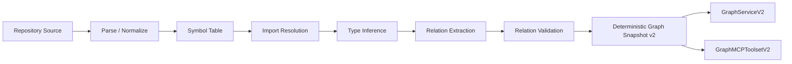

# repo-graph-rag

[](LICENSE)


> Deterministic repository graph intelligence research for Code Mesh.

`repo-graph-rag` is the public research artifact behind the Code Mesh line of
work. It is not a productized service and it is not presented as a complete
cross-language graph engine. The supported public path is a Python-first,
deterministic snapshot pipeline that turns repository source into reproducible
graph outputs with explicit provenance.

## Why This Repo Is Worth Reading

This repository is built around one narrow belief:

**repository understanding becomes much more reliable when context is
deterministic, traversable, and evidence-backed instead of purely probabilistic.**

That means:

- graph state should be inspectable and reproducible
- node and edge identity should be stable
- relations should explain how they were extracted
- public claims should stay narrower than the implementation can actually prove

## Research Lineage

The repo makes more sense as part of a sequence:

1. `llama-github` explored GitHub-native retrieval as a substrate.
2. `LlamaPReview` validated the practical value of high-quality code context.
3. `llamapreview-context-research` formalized the failure mode:
   **context instability**.
4. `repo-graph-rag` pushes the idea toward deterministic graph construction and
   traversal-first repository intelligence.

## Run The Demo In Under A Minute

From the repository root:

```bash
python3.11 -m venv .venv
.venv/bin/pip install -r repo_kg_maintainer/requirements.txt
PYTHONPATH=repo_kg_maintainer .venv/bin/python repo_kg_maintainer/main_v2.py \
  --tenant tenant-demo \
  --repo examples/python-demo \
  --commit demo-commit \
  --source examples/python_demo_repo \
  --output /tmp/python_demo_snapshot_v2.json
```

Expected stable result for the committed demo:

```json
{
  "graph_version": "2.0",
  "nodes": 14,
  "edges": 11,
  "schema_hash": "a4bc762e8e4e2d91c3c52f3dda836ef818c438c78c184a0d948249328a6a47a9",
  "snapshot_hash": "1c6493238faab5970ec76770a1ddafed05099c21a8d4b411776aa6111aecea1e"
}
```

The committed reference artifact lives at
`examples/python_demo_snapshot_v2.json`.

Comparison instructions live in [docs/validation.md](docs/validation.md).

## What The Demo Proves

The tiny demo repository is intentionally small but non-trivial. It exercises:

- file and symbol extraction
- local import resolution
- class instantiation
- method and function calls
- provenance-bearing edges

This is the public proof surface for the supported Python mainline.

## Concrete Example

From `examples/python_demo_repo/service.py`:

```python
from helpers import finalize
from workers import Worker

class TaskService:
    def execute(self, raw_value: str) -> str:
        worker = Worker()
        result = worker.work(raw_value)
        return finalize(result)
```

The resulting graph includes:

- `service.py::_file_ --IMPORTS--> Worker`
- `service.py::_file_ --IMPORTS--> finalize`
- `TaskService.execute --INSTANTIATES--> Worker`
- `TaskService.execute --CALLS--> Worker.work`
- `TaskService.execute --CALLS--> finalize`

Those edges also carry provenance such as:

- `imports.module.symbol`
- `instantiates.class.call`
- `calls.function.dispatch`

Example edge excerpt:

```json
{
  "relation_type": "CALLS",
  "source_id": "tenant-demo|examples/python-demo|demo-commit|Method|service.py::TaskService.execute",
  "target_id": "tenant-demo|examples/python-demo|demo-commit|Method|workers.py::Worker.work",
  "provenance": {
    "extractor_pass": "relation_extraction",
    "rule_id": "calls.function.dispatch",
    "source_span": [8, 18],
    "confidence": 0.9
  }
}
```

This is the central idea of the repo: not just extracting relations, but making
their origin visible and reproducible.

## What Is Actually Supported

The public support boundary is intentionally narrow:

- **Supported**: Python `v2` deterministic snapshot generation and its in-memory
  query / MCP parity foundations
- **Legacy**: Python + Arango full-build path kept for historical compatibility
- **Experimental**: Go analyzer subtree
- **Archived**: broken or environment-coupled research modules removed from the
  public runtime surface

## What You Can Trust Today

The Python `v2` path is the supported public contract.

Public interfaces:

| Interface | Purpose |
| :--- | :--- |
| `repo_kg_maintainer/main_v2.py` | Local CLI for deterministic snapshot generation |
| `repo_kg_maintainer/v2/analyzer/pipeline.py` | Pass-based Python graph extraction |
| `repo_kg_maintainer/v2/api/service.py` | Service contract for indexing and querying |
| `repo_kg_maintainer/v2/graph/store.py` | In-memory and Arango-backed snapshot stores |
| `repo_kg_maintainer/v2/mcp/toolset.py` | MCP-friendly deterministic graph queries |
| `repo_kg_maintainer/v2/serializer.py` | Canonical serialization and snapshot hashing |

This repo does not ask readers to trust a vague story. The supported path has:

- executable tests
- a committed demo repo
- a committed expected snapshot
- a deterministic snapshot hash for comparison

## Architecture Snapshot



The mainline pipeline is deliberately simple:

1. collect Python source files from a local repository root
2. parse and normalize files deterministically
3. extract file and symbol entities
4. resolve imports and infer relation targets
5. emit nodes and provenance-bearing edges
6. canonicalize the snapshot before saving or serving it

## Support Matrix

| Area | Status | Notes |
| :--- | :--- | :--- |
| Python `v2` snapshot pipeline | Supported | Primary public surface |
| `GraphServiceV2` / `GraphMCPToolsetV2` | Supported | Deterministic query layer over snapshots |
| Python + Arango legacy path | Legacy | Full-build only; no public incremental support |
| Go analyzer subtree | Experimental | Kept for research value, not default adoption |
| Document graph enrichment path | Archived | Removed from runtime support surface |

## Documentation Map

Start here if you want the supported path:

- [repo_kg_maintainer/README.md](repo_kg_maintainer/README.md)
- [docs/python-v2.md](docs/python-v2.md)
- [docs/demo-walkthrough.md](docs/demo-walkthrough.md)
- [docs/snapshot-schema.md](docs/snapshot-schema.md)

Boundary documents:

- [docs/legacy-arango.md](docs/legacy-arango.md)
- [docs/go-experimental.md](docs/go-experimental.md)
- [docs/validation.md](docs/validation.md)

Full docs index:

- [docs/README.md](docs/README.md)

## Known Limits

- Python is the only supported public extraction path.
- Java / JS / TS extraction exists, but relation extraction is not positioned as
  complete or public-mainline ready.
- The legacy Arango path remains coupled to `llama-github==0.3.3` and a pinned
  `langchain 0.2.x` compatibility stack.
- Incremental updates on the legacy path were an unfinished experiment and are
  intentionally not exposed as a public capability.
- The Go subtree is experimental and outside the default CI and support
  contract.

## Repository Notes

- Large generated graph artifacts and SVG outputs were removed from `HEAD`.
- Public docs now center the deterministic Python mainline and the committed
  demo proof surface.
- Historical modules removed from the runtime tip remain discoverable in git
  history, but they are not part of the public support boundary.

## License

Apache 2.0. See [LICENSE](LICENSE).

## Contributing

See [CONTRIBUTING.md](CONTRIBUTING.md).

## Security

See [SECURITY.md](SECURITY.md).
