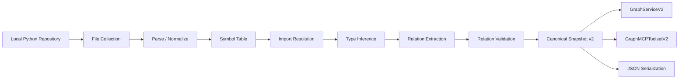

# Architecture

This repository has one supported public center and several intentionally
bounded side surfaces.

## Repository Position

- public identity: research artifact
- supported mainline: Python `v2` deterministic snapshot pipeline
- historical compatibility path: Python + Arango full-build workflow
- adjacent research branch: Go analyzer subtree
- removed runtime surfaces: archived in history or the archive boundary

## Top-Level Shape

| Area | Role | Status |
| :--- | :--- | :--- |
| `repo_kg_maintainer/main_v2.py` | local deterministic snapshot CLI | supported |
| `repo_kg_maintainer/v2/` | public analyzer, serializer, store, API, MCP layers | supported |
| `repo_kg_maintainer/main.py` | legacy Arango full-build CLI | legacy |
| `repo_kg_maintainer/repo_knowledge_graph.py` | legacy Arango graph persistence | legacy |
| `repo_kg_maintainer/code_analyze/go_analyzer/` | Go graph-analysis prototype | experimental |
| `repo_kg_maintainer/archive/` | non-supported retained references | archived |

## Mainline Data Flow

## Why The Mainline Starts From A Snapshot

The repository is organized around a simple principle:

- extraction should happen first
- serialization should preserve canonical state
- queries should operate over the extracted graph
- provenance should stay attached to relations all the way through

That prevents the public interface from collapsing into an opaque retrieval
stack where the context assembly logic cannot be inspected or replayed.

## Python `v2` Module Map

| Module | Responsibility |
| :--- | :--- |
| `v2/analyzer/pipeline.py` | orchestrates the deterministic analysis passes |
| `v2/analyzer/*.py` | parse, symbol, import, type, relation, and validation passes |
| `v2/models.py` | graph dataclasses and public data shapes |
| `v2/ids.py` | deterministic node/edge/schema identity logic |
| `v2/serializer.py` | canonicalization and snapshot hashing |
| `v2/graph/store.py` | in-memory and Arango-backed snapshot stores |
| `v2/api/service.py` | service contract for indexing and querying |
| `v2/mcp/toolset.py` | deterministic entity, relation, and subgraph access |
| `v2/ingestion/*.py` | job queue, delivery deduplication, invalidation planning |

## Runtime Topologies

### 1. Local Snapshot Build

- entrypoint: `main_v2.py`
- storage: none required
- output: canonical JSON snapshot
- ideal use: local validation, offline graph generation, fixture creation

### 2. In-Memory Query Runtime

- builder: `v2/runtime.py::build_in_memory_runtime`
- storage: in-memory
- output: `GraphServiceV2` and `IndexWorkerV2`
- ideal use: tests, lightweight prototypes, deterministic service validation

### 3. Arango-Backed v2 Runtime

- builder: `v2/runtime.py::build_arango_runtime`
- storage: ArangoDB
- output: service, worker, and store objects over snapshot v2 collections
- ideal use: storage-backed experiments for the supported snapshot model

### 4. Legacy Arango Full Build

- entrypoint: `main.py`
- retrieval substrate: `llama-github`
- storage: ArangoDB
- status: historical compatibility only

## Why Legacy And Go Remain

The repository is not pretending they are equal to the public mainline.

They remain because they carry real value:

- legacy Python preserves the earlier `llama-github -> graph` workflow
- Go preserves a serious experimental branch around AST graphs and MCP access

What changed is the public claim, not the fact that those branches existed.

## Non-Goals For This OSS Release

- no promise of complete multi-language relation extraction
- no promise of production deployment hardening
- no promise of stable APIs in the Go subtree
- no promise of incremental indexing on the legacy path
